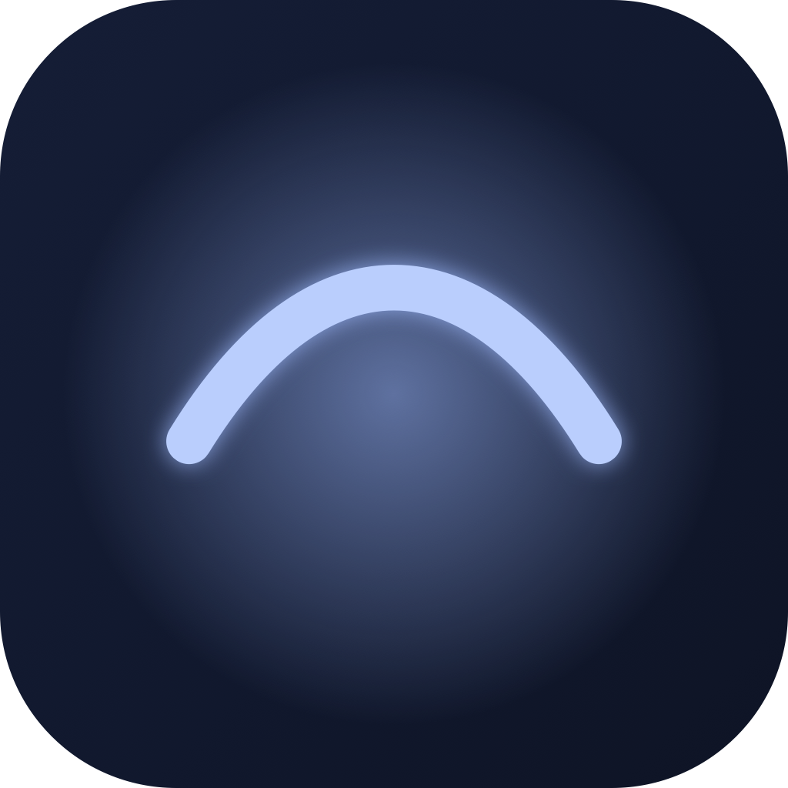

<div align="center">



# Winkle

**App macOS de barre de menus, gratuite et open source, qui automatise la règle 20-20-20 pour reposer tes yeux — sans te harceler.**

Toutes les 20 minutes, regarder à ~6 mètres pendant 20 secondes, pour réduire la fatigue oculaire.

  

</div>

**Principe : l'outil sert l'utilisateur, il ne le harcèle pas.**
Minimalisme, calme, zéro culpabilisation.

## Fonctionnalités

- **Détection intelligente de l'usage réel** — le compteur ne tourne que quand
  tu utilises vraiment clavier ou souris ; si tu t'absentes (90 s par défaut),
  Winkle considère que tes yeux se reposent déjà et repart de zéro.
- **Ne dérange jamais au mauvais moment** — suspension automatique en visio
  (caméra active), en vidéo plein écran, quand « Ne pas déranger » est actif,
  ou dans les apps que tu whitelist. Suspension manuelle 1 h / 2 h / illimitée.
- **Invitation douce** — pré-alerte 20 s avant, overlay apaisant (fond bleuté
  qui suit le curseur), boutons « Reporter · +5 min » et « Ignorer » sans limite
  ni culpabilisation. Mode strict optionnel pour les motivés.
- **Presets** — 20-20-20 (défaut) · Intense (15 min / 20 s) · Détendu
  (30 min / 30 s) · Custom.
- **Privacy-first** — aucune donnée ne quitte la machine, zéro tracking.
  La détection d'activité lit uniquement des délais d'inactivité (jamais le
  contenu des frappes) ; la détection visio lit un statut caméra (jamais le flux).

## Installation

1. Télécharge le `.dmg` depuis la [page des Releases](../../releases/latest).
2. Ouvre-le, glisse **Winkle** dans **Applications**.
3. Premier lancement : **clic droit sur l'app → Ouvrir** (l'app est signée mais
   pas encore notariée par Apple, donc Gatekeeper demande cette confirmation une
   seule fois).

Ensuite Winkle vit dans la barre de menus, sans icône dans le Dock. Un onboarding
te propose ton rythme au premier démarrage.

## Développement

```bash
make run    # binaire nu (dev rapide ; ni notifications ni login item)
make open   # construit et lance build/Winkle.app (expérience complète)
make dmg    # construit build/Winkle-x.y.z.dmg partageable
make icon   # régénère l'icône .icns
```

> `make run` n'a ni notifications ni lancement au démarrage : ces API exigent
> un vrai bundle `.app`. Elles fonctionnent dès `make open` / le DMG installé.

Swift 5.9+ · SwiftUI · macOS 13+ · aucune dépendance externe.

## Structure

| Fichier | Rôle |
|---|---|
| `BreakEngine.swift` | Machine à états du cycle (actif / repos naturel / suspendu, pause) |
| `ActivityMonitor.swift` | Inactivité clavier & souris via CGEventSource |
| `SuspensionMonitor.swift` | Règles "ne jamais déranger" : visio, plein écran, whitelist, Focus |
| `OverlayController.swift` | Fenêtres d'overlay par écran, fondus |
| `Views/` | Overlay, réglages, onboarding, style partagé |

## Contribuer

Les retours, bugs et idées sont bienvenus — ouvre une
[issue](../../issues) ou une pull request. Le projet n'a aucune dépendance
externe : `git clone`, puis `make open` suffit pour lancer ta version.

## Licence

MIT — gratuit, pour toujours. Si Winkle t'aide, tu peux
[m'offrir un café ☕](https://buymeacoffee.com/julesbertolino).
